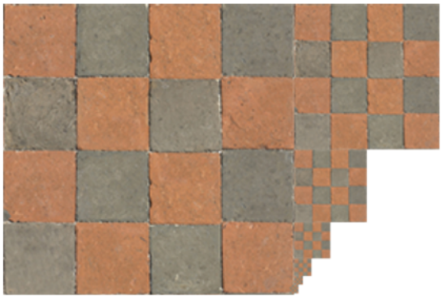

# 👾 Texture(UV Mapping)

Vertex에 color를 지정하는 방법을 통해 3D 이미지를 표현하기엔 너무 많은 vertex를 필요로 하기에, 고안된 방법으로, 면에 이미지로 된 스티커를 입히는 방식. 저렴한 방식으로 고품질의 렌더링 결과를 생성할 수 있다.


### 텍스처 좌표

각 정점별로 어느 이미지를 입힐 지에 대해 별도의 좌표를 지정.

* \[0,1]사이의 정규화(normalized)된 좌표계
* 이미지의 좌하단이 항상 (0,0)이다.

<figure><figcaption><p>texture 예시</p></figcaption></figure>

### Texture Coordinate

텍스처 좌표가 정점의 위치와 함께 vertex attributes 형태로 vertex shader에 입력된다.

Rasterization 과정을 거쳐서 각 픽셀별 텍스처 좌표값이 계산된다.

Fragment shader에서 텍스처 좌표를 바탕으로 텍스처 이미지의 색상 값을 가지고 온다.


### Texture Wrapping

\[0,1] 범위를 벗어난 텍스쳐 좌표값을 처리하는 옵션

<figure><figcaption></figcaption></figure>

* `gl_repeat`: 이미지를 타일링하는 효과를 줌
* `gl_mirrored_repeat`: 이미지를 타일링 하되, 반전 효과 주어 붙인다. 경계를 잘 보이지 않게끔 하는 효과를 준다.
* `gl_clamp_to_edge`: 제일 많이 사용하며, 직선거리로 가장 가까운 픽셀의 값을 가져다 쓴다.
* `gl_clamp_to_border`: 경계쪽의 색을 하나 정해서, 벗어난 좌표는 지정해둔 해당 색상으로 처리한다.


### Texture Filtering

#### filtering option

텍스처로 사용할 이미지의 크기가 화면보다 크거나 작을 경우 사용하는 옵션이다.

* `gl_nearest`: 텍스쳐 좌표값에 가장 가까운 픽셀값을 사용

<figure><figcaption><p>gl_nearest 반환색</p></figcaption></figure>

* `gl_linear`: 텍스쳐 좌표값 주변 4개의 픽셀값을 보간하여 사용.

<figure><figcaption><p>gl_linear 반환색</p></figcaption></figure>

<figure><figcaption><p>gl_nearest vs gl_linear</p></figcaption></figure>


### OpenGL 에서 텍스처를 사용하는 방법

1. openGL texture object 생성 및 바인딩
2. wrap\[ing, filtering option 설정
3. 이미지 데이터를 gpu 메모리로 복사
4. shader 프로그램이 바인딩 되었을 때 사용하고자 하는 texture를 uniform 형태로 프로그램에 전달


### Image loading

Stb library 를 사용해서 이미지를 로드한다.

#### STB library

single-file public domain library로, 헤더 파일 하나에 라이브러리가 제공하려 하는 모든 기능이 구현되어있다. 따라서 빌드가 매우 간편하다는 장점을 가진다.

#### stb\_image

jpg, png, tga, bmp, psd, gif, hdr, pic 포맷을 지원하는 이미지 로딩 라이브러리이다.


#### Image객체 생성

```cpp
#ifndef __IMAGE_HPP__
#define __IMAGE_HPP__

#include "Common.hpp"

CLASS_PTR(Image)
class Image {
public:
    static ImageUPtr Load(const std::string& filepath);
    ~Image();

    const uint8_t* GetData() const { return m_data; }
    int GetWidth() const { return m_width; }
    int GetHeight() const { return m_height; }
    int GetChannelCount() const { return m_channelCount; }

private:
    Image() {};
    bool LoadWithStb(const std::string& filepath);
    int m_width { 0 };
    int m_height { 0 };
    int m_channelCount { 0 };
    uint8_t* m_data { nullptr };
};

#endif
```

기본 구조는 앞에서 작성해왔던 구조와 비슷하며, load 를 통해서 관리하고, getter들만 세팅한다.


#### image 관련 함수

```cpp
stbi_set_flip_vertically_on_load(true);
m_data = stbi_load(filepath.c_str(), &m_width, &m_height, &m_channelCount, 0);
```

#### `stbi_set_flip_vertically_on_load(true)`

보통의 image는 좌상단을 원점으로 잡는데, opengl에서는 좌하단을 원점으로 잡아서 상하반전이 일어나는 경우가 생긴다. 이를 방지하기 위에 `stbi_set_flip_vertically_on_load(true)`함수를 사용하여 상하 반전을 시켜준다.

#### `stbi_load()`

stb 라이브러리 안에 있는 함수로, 매개변수로 첫번째 인자는 char \* 형태로 받기에, c\_str()로 변환을 해줘야한다. m\_width, m\_height, m\_channelCount를 주소값을 집어넣어서 값이 반환되게끔 처리하며, 해당 함수의 반환값은 해당 이미지의 주소값이 반환된다.


### 텍스처 적용

텍스처 적용을 위해서는 추가적으로 vertex shader에 vertex attribute에 texture 좌표를 추가해야하며, 텍스처를 읽어들여 픽셀값을 결정하는 shader를 작성해야 한다.


### Texture 관련 openGL API 함수

* `glGenTextures()`: OpenGL texture object 생성
* `glBindTexture()`: 사용하고자 하는 텍스처 바인딩
* `glTexParameteri()`: 텍스처 필터 / 래핑 방식 등 파라미터 설정
* `glTexImage2D(target, level, internalFormat, width, height, border, format, type, data)`
  * 바인딩된 텍스처의 크기 / 픽셀 포맷을 설정하고 GPU에 이미지 데이터를 복사
  * `target`: 대상이 될 바인딩 텍스처
  * `level`: 설정할 텍스처 레벨. 0레벨이 base.
  * `internalFormat`: **텍스처**의 픽셀 포맷(GL\_RGB, GL\_RED, GL\_RG 와 같이 쓸 수 있음)
  * `width`: 텍스처 / 이미지의 가로 크기
  * `height`: 텍스처 / 이미지의 세로 크기
  * `border`: 텍스처 외곽의 border 크기
  * `format`: 입력하는 **이미지**의 픽셀 포맷
  * `type`: 입력하는 **이미지**의 채널별 데이터 타입
  * `data`: 이미지 데이터가 기록된 메모리 주소

#### 텍스처  크기

* 가로/세로의 크기가 2의 지수 형태일 때 GPU가 가장 효율적으로 처리할 수 있다.
* NPOT (Non-Power-Of-Two) texture
  * 2의 지수 크기가 아닌 텍스처는 GPU의 스펙에 따라 지원을 안하는 경우도 있다


### 텍스처 생성

아래와 같은 방식으로, 픽셀을 직접 찍어서 체크 무늬와 같은 이미지를 직접 생성하는 것 또한 가능하다.

```cpp
ImageUPtr Image::Create(int width, int height, int channelCount) {
    auto image = ImageUPtr(new Image());
    if (!image->Allocate(width, height, channelCount))
        return nullptr;
    return std::move(image);
}

bool Image::Allocate(int width, int height, int channelCount) {
    m_width = width;
    m_height = height;
    m_channelCount = channelCount;
    m_data = (uint8_t *)malloc(m_width * m_height * channelCount);
    return m_data ? true : false;
}

// 체크 무늬 이미지 생성
void Image::SetCheckImage(int gridX, int gridY) {
    for (int j = 0; j < m_height; j++) {
        for (int i = 0; i < m_width; i++) {
            int pos = (j * m_width + i) * m_channelCount;
            bool even = ((i / gridX) + (j / gridY)) % 2 == 0;
            uint8_t value = even ? 255 : 0;
            for (int k = 0; k < m_channelCount; k++)
                m_data[pos + k] = value;
            if (m_channelCount > 3)
                m_data[3] = 255;
        }
    }
}
```

이러한 방식을 사용하게 되면, 화면을 축소할때 의도치 않은 결과값이 생기는 경우가 있는데, 이는 화면에 그리는 픽셀보다 텍스처 픽셀의 영역(이미지 크기)이  클때, filter에서 GL\_LINEAR로는 이러한 문제가 해결이 안 되는 현상이 나타난다. 화면에 그리는 픽셀이 여러 텍스처 픽셀을 포함하게되면서 생기는 문제이고, 이를 해결하기 위한 방법이 mipmap 기법이다.


### Mipmap

화면 픽셀이 여러 텍스처 픽셀을 포함하게 될 경우, 작은 사이즈의 이미지를 미리 준비하는 기법

<figure><figcaption></figcaption></figure>

#### Mipmap의 원리

1. 가장 큰 이미지의 크기의 기본 level을 0으로 둔다.
2. 가로 세로를 절반씩 줄인 이미지(1/4 크기)를 미리 계산하고, 이를 1 level씩 증가시켜 가며 저장.
   * 512x512 이미지 => level 0\~9까지 생성

해당 방식을 사용하게 될 경우, 원본 이미지 저장을 위해 필요한 메모리보다 1/3만큼을 더 사용하게 된다.


#### Mipmap 관련 함수 및 옵션

* `GL_NEAREST_MIPMAP_NEAREST`: 적합한 레벨의 텍스처를 선택한 뒤 nearest neighbor 픽셀을 선택한다
* `GL_LINEAR_MIPMAP_LINEAR`: 적합한 두 레벨의 텍스처에서 linear filtering된 값을 다시 linear interpolation한다 (trilinear interpolation)
* `glGenearteMipmap()`: 바인딩 된 이미지의 Mipmap을 만들어준다.

```cpp
SetFilter(GL_NEAREST_MIPMAP_NEAREST, GL_LINEAR);
SetFilter(GL_LINEAR_MIPMAP_LINEAR, GL_LINEAR);
glGenerateMipmap(GL_TEXTURE_2D);
```


### 텍스처를 Shader program에 올바르게 제공하는 방법

1. `glActiveTexture(textureSlot)` 함수로 현재 다루고자 하는 텍스처 슬롯을 선택한다. 하나의 쉐이더에서 동시에 사용 가능한 texture는 한번에 32개 까지다.
2. `glBindTexture(textureType, textureId)` 함수로 현재 설정중인 텍스처 슬롯에 우리의 텍스처 오브젝트를 바인딩
3. `glGetUniformLocation()` 함수로 shader 내의 sampler2D uniform 핸들을 얻어옴
4. `glUniform1i()` 함수로 sampler2D uniform에 **텍스처 슬롯 인덱스**를 입력

